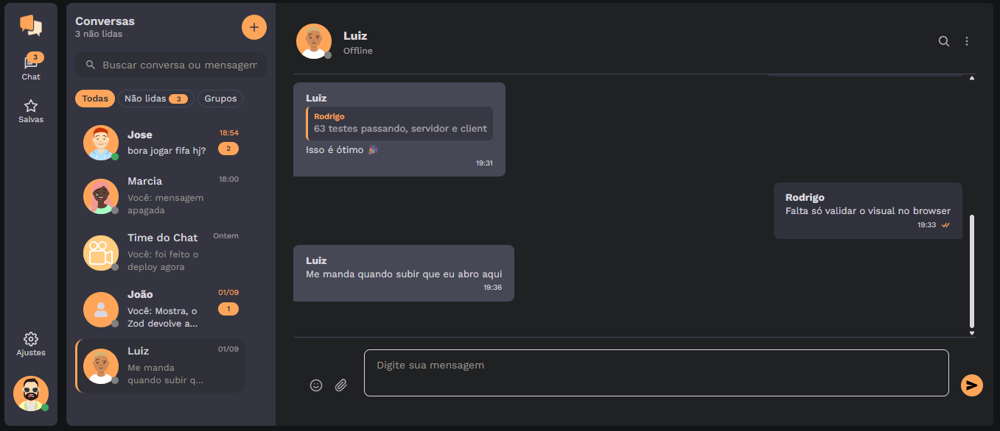

# React Socket Chat



## 📖 Sobre

**React Socket Chat** é um chat em tempo real completo — conversas diretas, grupos, anexos, reações, buscas e presença — construído como um monorepo pnpm com três pacotes:

- **`chat/`** — o cliente React (Vite + TypeScript + SCSS).
- **`server/`** — a API Express 5 com Socket.IO, Prisma e SQLite.
- **`packages/shared/`** — o contrato entre os dois: tipos da API, eventos de socket, limites e schemas Zod, escritos uma vez e usados nos dois lados.

As mensagens trafegam por WebSocket (Socket.IO) e o histórico é persistido em SQLite via Prisma. A autenticação usa JWT de vida curta com refresh token em cookie `httpOnly`, e a mesma lista de regras de senha, limites e eventos vale no servidor e na tela — porque mora no pacote compartilhado.

---

## ✨ Funcionalidades

- 💬 **Tempo real**
  - Entrega instantânea por Socket.IO, indicador de "digitando…", recibos de leitura e presença online/offline com "visto por último".
  - Aviso de reconexão quando a conexão cai, e badge de não lidas no título da aba.

- 👥 **Conversas diretas e grupos**
  - Grupos com administrador, adicionar e remover membros, nome, foto e descrição.
  - Link de convite que pode ser gerado e revogado, e mensagens de sistema para as mudanças do grupo.

- ✉️ **Mensagens**
  - Responder, editar, apagar para mim ou para todos (janela de 60 minutos), encaminhar para até 20 conversas.
  - Reações com emoji, menções `@` em grupos, fixar mensagem na conversa e salvar mensagens numa lista própria.
  - Histórico paginado e lista virtualizada — conversas longas rolam sem travar.

- 📎 **Anexos**
  - Imagens, vídeos, PDF e texto até 10 MB, com o tipo conferido pelos bytes do arquivo (não pela extensão).
  - URLs assinadas e com validade: quem não participa da conversa não abre o arquivo mesmo tendo o link.
  - Galeria da conversa separada por abas e visor com download.

- 🔎 **Busca**
  - Busca full-text dentro da conversa usando FTS5 do SQLite, com destaque dos trechos.
  - Busca na lista de conversas e nos contatos.

- 🗂️ **Organização da lista**
  - Fixar, arquivar, silenciar (8 horas, 1 semana ou sempre), marcar como não lida, limpar histórico e apagar a conversa.
  - Filtros por "Todas", "Não lidas" e "Grupos".

- 🔐 **Conta e privacidade**
  - Perfil com avatar (upload com recorte), bio e status (Disponível, Ocupado, Ausente, Não perturbe).
  - Controle de quem vê o "visto por último" e os recibos de leitura; bloquear e desbloquear contatos.
  - Dispositivos conectados com revogação de sessão, exportação dos próprios dados e exclusão da conta.

- 🛡️ **Segurança**
  - JWT curto + refresh token em cookie `httpOnly`, proteção CSRF e rate limit em login, cadastro, envio, uploads e buscas.
  - Senhas com bcrypt e regras validadas no servidor (mínimo de 8 caracteres, com letra e número); `helmet` nos cabeçalhos.

- 🎨 **Interface**
  - Tema claro e escuro, layout responsivo do desktop ao celular, notificações do navegador e code splitting por rota.

---

## 🚀 Tecnologias Utilizadas

### Cliente (`chat/`)

- **[React 18](https://react.dev/)** + **[TypeScript](https://www.typescriptlang.org/)**: interface e tipagem de ponta a ponta.
- **[Vite 5](https://vite.dev/)**: dev server e build, com chunks manuais e rotas em `lazy`.
- **[React Router 6](https://reactrouter.com/)**: a conversa aberta é um endereço (`/c/:chatId`).
- **[TanStack Query](https://tanstack.com/query)**: cache e revalidação dos dados da API.
- **[TanStack Virtual](https://tanstack.com/virtual)**: virtualização das listas longas.
- **[Zustand](https://zustand.docs.pmnd.rs/)**: estado global enxuto (UI e toasts).
- **[socket.io-client](https://socket.io/)**, **[Axios](https://axios-http.com/)**, **[Sass](https://sass-lang.com/)**, **[emoji-mart](https://github.com/missive/emoji-mart)** e **[react-icons](https://react-icons.github.io/react-icons/)**.

### Servidor (`server/`)

- **[Node.js 22](https://nodejs.org/)** + **[TypeScript](https://www.typescriptlang.org/)**.
- **[Express 5](https://expressjs.com/)**: rotas HTTP da API.
- **[Socket.IO 4](https://socket.io/)**: eventos em tempo real.
- **[Prisma 7](https://www.prisma.io/)** + **[SQLite](https://www.sqlite.org/)** (adapter `better-sqlite3`): banco, migrations e seed.
- **[JWT](https://github.com/auth0/node-jsonwebtoken)** + **[bcryptjs](https://github.com/dcodeIO/bcrypt.js)**: autenticação e hash de senha.
- **[Helmet](https://helmetjs.github.io/)**, **[express-rate-limit](https://express-rate-limit.mintlify.app/)**, **[cors](https://github.com/expressjs/cors)** e **[cookie-parser](https://github.com/expressjs/cookie-parser)**.
- **[Multer](https://github.com/expressjs/multer)** + **[sharp](https://sharp.pixelplumbing.com/)** + **[file-type](https://github.com/sindresorhus/file-type)**: upload, redimensionamento e checagem dos anexos.
- **[Pino](https://getpino.io/)**: logs estruturados.

### Compartilhado e ferramentas

- **[Zod 4](https://zod.dev/)**: schemas de validação usados pelo servidor e pelo cliente (`packages/shared`).
- **[pnpm workspaces](https://pnpm.io/workspaces)**: monorepo com catálogo de versões.
- **[Vitest](https://vitest.dev/)**, **[Supertest](https://github.com/ladjs/supertest)** e **[Testing Library](https://testing-library.com/)**: testes do servidor e do cliente.
- **[ESLint](https://eslint.org/)** com `typescript-eslint`.

---

## ⚙️ Como Executar o Projeto

### Pré-requisitos

- [Node.js](https://nodejs.org/) 22 ou superior
- [pnpm](https://pnpm.io/) 9 ou superior (`npm install -g pnpm`)

### Passos

1. **Clone o repositório:**
   ```bash
   git clone https://github.com/rodrisoares/react-socket-chat.git
   ```

2. **Acesse o diretório do projeto:**
   ```bash
   cd react-socket-chat
   ```

3. **Instale as dependências** (na raiz, uma vez para todo o monorepo):
   ```bash
   pnpm install
   ```

4. **Crie os arquivos de ambiente:**
   ```bash
   cp server/.env.example server/.env
   cp chat/.env.example chat/.env
   ```

   No `server/.env`, troque o `JWT_SECRET` por um valor aleatório:
   ```bash
   node -e "console.log(require('crypto').randomBytes(48).toString('hex'))"
   ```

5. **Crie o banco e popule com os dados de teste:**
   ```bash
   pnpm db:reset
   ```

   O banco (`server/dev.db`) não é versionado: este comando aplica todas as migrations e roda o seed em seguida.

6. **Suba o servidor e o cliente:**
   ```bash
   pnpm dev
   ```

   O comando compila o pacote compartilhado e sobe tudo em paralelo: API em `http://localhost:8080` e tela em `http://localhost:5173`.

Se preferir subir um de cada vez, em dois terminais:

```bash
pnpm --filter server dev   # API + Socket.IO na porta 8080
pnpm --filter chat dev     # Vite na porta 5173
```

---

## 👤 Usuários de Teste

O seed cria quatro contas — **todas com a mesma senha: `senha123`**:

| Nome    | E-mail              | Senha      | Observação                                           |
| ------- | ------------------- | ---------- | ---------------------------------------------------- |
| Rodrigo | `rodrigo@email.com` | `senha123` | Conta principal, com foto e bio; participa de tudo    |
| Luiz    | `luiz@email.com`    | `senha123` | Status "Ocupado"                                      |
| Marcia  | `marcia@email.com`  | `senha123` | Status "Ausente"                                      |
| João    | `joao@email.com`    | `senha123` | Sem foto e sem bio, de propósito — exercita os vazios  |

Junto com as contas vêm **5 conversas** (4 diretas e o grupo **"Time do Chat"**) já povoadas: mensagens respondidas, uma editada, uma apagada, conversas com não lidas e outras já lidas — o bastante para ver a interface cheia sem digitar nada.

Para entrar com duas contas ao mesmo tempo e ver o tempo real funcionando, abra a segunda numa janela anônima (a sessão fica no cookie do navegador).

### Comandos do banco

| Comando          | O que faz                                                                     |
| ---------------- | ----------------------------------------------------------------------------- |
| `pnpm db:seed`   | Roda o seed sobre o banco atual (apaga usuários, conversas e mensagens antes)  |
| `pnpm db:reset`  | Apaga o banco, reaplica todas as migrations e roda o seed em seguida           |
| `pnpm db:studio` | Abre o Prisma Studio para inspecionar as tabelas                              |

> Os dois primeiros **apagam os dados existentes**: qualquer conta criada pela tela some junto.

---

## 📜 Scripts

Na raiz, valendo para todo o monorepo:

| Script           | O que faz                                                          |
| ---------------- | ------------------------------------------------------------------ |
| `pnpm dev`       | Compila o `shared` e sobe servidor, cliente e o watch do contrato   |
| `pnpm build`     | Build de produção de todos os pacotes                              |
| `pnpm test`      | Vitest no servidor (com Supertest) e no cliente                     |
| `pnpm typecheck` | `tsc --noEmit` em todos os pacotes                                  |
| `pnpm lint`      | ESLint em todos os pacotes                                          |
| `pnpm db:seed`   | Popula o banco com os usuários e conversas de teste                 |
| `pnpm db:reset`  | Recria o banco do zero e roda o seed                                |
| `pnpm db:studio` | Abre o Prisma Studio                                                |

Cada pacote também aceita os próprios scripts via `pnpm --filter <pacote> <script>` — por exemplo `pnpm --filter server test:watch` ou `pnpm --filter chat build`.

---

## 🗂️ Estrutura

```
.
├── chat/                  # Cliente React (Vite)
│   ├── public/
│   └── src/
│       ├── components/    # Componentes de UI, um diretório por componente
│       ├── hooks/         # Socket, presença, busca, notificações, tema…
│       ├── pages/         # Home, Login, Signup, Saved, Settings
│       ├── store/         # Zustand (UI e toasts)
│       └── utils/
├── server/                # API Express + Socket.IO
│   ├── prisma/            # schema.prisma, migrations e seed.ts
│   ├── src/
│   │   ├── config/        # env, prisma, jwt, uploads, logger
│   │   ├── controllers/   # auth, chats, messages, me
│   │   ├── middlewares/   # auth, CSRF, rate limit, validação, erros
│   │   ├── repositories/  # acesso ao banco (inclui a busca FTS)
│   │   ├── routes/        # /api/auth, /api/chats, /api/me
│   │   ├── services/      # regras de negócio
│   │   └── socket/        # eventos em tempo real e presença
│   └── tests/             # Vitest + Supertest
└── packages/shared/       # Contrato: tipos da API, eventos, limites e schemas Zod
```

O contrato da API também é publicado em `GET /api/openapi.json`, e há um `GET /health` para checagem de disponibilidade.
